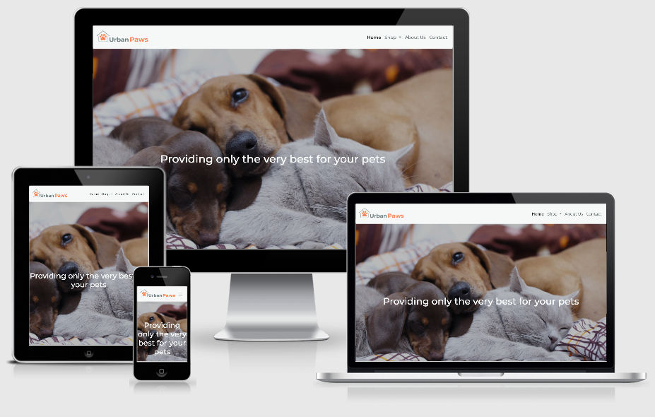

# Urban Paws Website

Working with the company director, this website has been developed as the first iteration for a new startup company Urban Paws. The website provides potential customers with an overview of the company and information in relation to products that have been developed and products that are for sale via links to listings on Amazon.co.uk.

The client requested a simple, attractive and modern website that is responsive and easy to navigate, allows potential customers to sign up for email updates on company news, provides links to the company social media accounts and links to enable the customer to purchase products.

The site was developed using knowledge gained from the Code Institute HTML, CSS and User Centric Frontend Development modules.

View the live website [here.](https://matty-el.github.io/urban-paws/)

## Contents

1.  [User Experience Design](#user-experience-design)
2.  [Features](#features)
3.  [Technologies Used](#technologies-used)
4.  [Testing](#testing)
5.  [Deployment](#deployment)
6.  [Credits](#credits)

## User Experience Design

### Strategy

The business goals for developing the website are:

-   To attract users to the company website to promote the company and brand awareness and to drive online enquiries.
-   To enable users to link through to Amazon listings so that they can purchase products.
-   To provide a simple, attractive, modern and responsive website.
-   To present a consistent brand image to users.

### Scope

#### User Stories

#### Business

-   As the branding director, I want the company branding template to be applied to the website so that the company presents a consistent brand image.
-   As the business owner, I want the company website latency to be optimised so that users are less likely to abandon our website whilst using it.
-   As the business owner, I want the company website to be search engine optimised so that users can easily find our website.
-   As the business owner, I want the company website to be accessible to all users so that all users can use our website.
-   As the business owner, I want the company website to be conformant to web development best practices so that I know the development quality meets required standards.
-   As the business owner, I want the company website to be compatible with different browsers so that users have a consistent experience no matter which browser they use.

#### Website users

-   As a website user, I want to be able to access the website on different devices so that i can use the device that is most convenient to me at the time.
-   As a website user, I want to be able to easily navigate the website so that I can find out more about the company and its offerings.
-   As a website user, I want to be able to follow the company on social media platforms so that I can stay informed about the company.
-   As a website user, I want to be able to contact the company so that I can ask questions or receive announcements and updates about the company.
-   As a website user, I want to be able see products for purchase and details of those products so that I can buy items I need.

### Structure

The Urban Paws website has been structured to provide a simple and easy to navigate website. There are four pages - Home, Shop Dog, Shop Cat and About Us and a Contact form so that users can contact the company to provide comments, make enquiries and / or sign up to the Urban Paws newsletter.

The website has the following key elements:

-   A simple navigation menu that enables the users to easily navigate between the website pages.
-   Links to social media sites so that users can follow the company on social media.
-   Call to action buttons are present on the Home page to encourage the users to click through to the contact form and shop pages.
-   The shop pages contain the product listings along with size guides and a link to enable the customers to purchase the   products via Amazon.co.uk.
-   The contact menu item provides a form which the users can populate to provide comments, make enquiries and / or sign up to the Urban Paws newsletter.

### Skeleton

#### Wireframes

The wireframes were developed using [Balsamiq](https://balsamiq.com/).

-   Small device [wireframes](design/urban-paws-wireframes-small-device-v1.pdf).
-   Medium device [wireframes](design/urban-paws-wireframes-medium-device-v1.pdf).
-   Large device [wireframes](design/urban-paws-wireframes-large-device-v1.pdf).

After the initial design was finalised the following changes were agreed and made:

-   The Contact Us page was replaced with a contact form modal as this was considered a cleaner implementation of the form.
-   The main Shop page was removed to simplify the website design and layout.
-   An About Us page was added to include the team member profiles.
-   As shopping basket functionality will be a future development a decision was made to simplify the product card layout and provide a link to Amazon.co.uk.

### Surface

Working with the client an [Urban Paws Branding Template](design/urban-paws-branding-template.pdf) has been developed to ensure a strong and consistent brand image has been applied to the Urban Paws website.

#### Branding

An Urban Paws logo has been developed and is displayed prominently on the website pages.

#### Colours

A simple colour palette has been developed based on the three core Urban Paws colours. Full details of the colour scheme are contained in the [Urban Paws Branding Template](design/urban-paws-branding-template.pdf).

#### Typography

The Montserrat font has been utilised for all menu and heading text across the website. Raleway font has been used for the main text sections. Full details of the typography used are contained in the [Urban Paws Branding Template](design/urban-paws-branding-template.pdf).

## Features

### Existing Features

#### All pages

Header:

-   The brand logo linking to the Home page is displayed on the top left of each page.
-   A navigation menu on the top right of each page that allows the user to navigate the website by clicking the links or open a contact form by selecting the Contact menu item. There is a dropdown menu for the individual Shop Dog and Shop Cat pages. The menu links change colour when hovered over and are highlighted in a different colour when the user is currently on that page.
-   The contact form can be populated with mandatory first name, last name, email address and animal preference along with the options to add a comment or enquiry and to sign up to the company newsletter.

*Note: The contact form does not currently submit any data. The final version of the form will submit data to a back-end database and will present a message to the user upon submitting the form.*

Footer:

-   A footer section displaying copyright wording, a Union Jack flag and links to Facebook, Twitter, YouTube, Instagram and Pinterest social media sites.

#### Home page

What we do section:

-   This section of the Home page outlines what the company does and provides a call to action 'Find Out More' button to open the contact form. The contact form can be populated with mandatory first name, last name, email address and animal preference along with the options to add a comment or enquiry and to sign up to the company newsletter.

*Note: The contact form does not currently submit any data. The final version of the form will submit data to a back-end database and will present a message to the user upon submitting the form.*

PADD Suit section:

-   This section of the Home page outlines a product the company has developed - the PADD Suit. There are two buttons included in this section to link through to the Shop Dog and Shop Cat pages.

#### Shop Cat and Shop Dog pages

-   These pages contain the product listings with a product card for each individual product.
-   The product cards include a picture of each product along with a product description, sizes and colour swatches that expand when hovered over.
-   The footer section of the product cards has a size guide button which when clicked opens a size guide for the products. There is a 'Buy on Amazon' button that links to the Amazon.co.uk website when clicked.

*Note: The buttons to link to the Amazon.co.uk website will be pre-populated with the listing search details once the listings are on Amazon.*

#### About us page

-   This page contains a simple profile for each of the members of the Urban Paws team.

### Features Left to Implement

-   Active product links to Amazon.co.uk.
-   Contact form data submission and acknowledgement.
-   Urban Paws Blog.
-   Featured products.
-   Shopping cart.
-   eCommerce capabilities.

## Technologies Used

The following technologies have been used to complete the UX design, capture user stories and defects and assign for development and to develop the Urban Paws website.

### Languages

-   [HTML5](https://en.wikipedia.org/wiki/HTML5) - used for the structure and content of the Urban Paws website.
-   [CSS3](https://en.wikipedia.org/wiki/CSS) - used to style the Urban Paws website.

### Frameworks - Tools - Libraries

-   [Bootstrap library](https://getbootstrap.com/) - utilised for the grid layout, buttons, navigation bar and modal elements of the website.
-   [GitHub](https://github.com/) - for hosting the website repository.
-   [GitPod](https://gitpod.io/) - used as the development environment for the website.
-   [Google Fonts](https://fonts.google.com/) - used to source the Montserrat font for headings and Raleway font the main text content.
-   [Font Awesome](https://fontawesome.com/) - used to source icons for the footer section of the website.
-   [Balsamiq](https://balsamiq.com/) - utilised for the development of the website wireframes.
-   [Tiny PNG](https://tinypng.com/) - for the compression of images for all pages of the website.
-   [Canva](https://canva.com/) - used to remove the background of the images for the product cards.
-   [JIRA](https://www.atlassian.com/software/jira) - for the tracking of development tasks (user stories and subtasks) and capturing and tracking defects.
-   [Frontify](https://www.frontify.com) - used to develop the Urban Paws branding guidelines template.
-   [Markup validation service](https://validator.w3.org/) - for the validation of HTML5 code.
-   [CSS validation service](https://jigsaw.w3.org/css-validator/) - for the validation of the CSS3 code.
-   [Google Chrome DevTools](https://developers.google.com/web/tools/chrome-devtools) - used to edit changes prior to implementing the code changes, to diagnose problems and for performance, accessibility, best practice and search engine optimisation testing.

## Testing

The website functionality was captured in the form of user stories and acceptance criteria were defined for each user story. The acceptance criteria formed the basis for the completed tests to ensure that the functionality was delivered aligned to the client's requirements.

The testing strategy, plan and results are documented in a separate [testing document](TESTING.md).

## Deployment

The Urban Paws project is hosted on GitHub Pages.

**To deploy the project on GitHub**

1. Navigate to the menu at the top of the project repository on GitHub and select **Settings**.
2. Scroll down to the GitHub **Pages** section.
3. Click on the dropdown menu under **Source** and select **master** branch.
4. Ensure that the folder selected is the **(root)** folder.
5. Click the **Save** button.
6. The page will refresh automatically, and the website is now deployed - a green tick will be visible against a green background with the site URL. It may take a few minutes for the site to be published.

A single master branch has been used for this project.

**To run the project locally**

To clone this project from GitHub.

1. Open the project repository on GitHub and click the **Code** dropdown button.
2. Select the **HTTPS** tab and copy the URL.
3. Open your terminal (Mac OS, Linux) or Git-Bash terminal (Windows).
4. Change the current working directory to the location where you want the cloned directory to be created.
5. Type **git clone**, enter a space and then paste the URL copied from GitHub.
6. Press **Enter** and the local clone will be created in the specified directory.

## Credits

### Content

All text content included in the Urban Paws website is my own.

The code for the product card colour swatches has been adapted from [codepen.io product card example](https://codepen.io/virgilpana/pen/RNYQwB/).

### Media

-   All images, with the exception of those detailed below, were licensed for use from [Adobe Stock](https://stock.adobe.com/).
-   The image for the 'What we do' section on the Home page - [photo by Kelly Sikkema on Unplash](https://unsplash.com/@kellysikkema?utm_source=medium&utm_medium=referral).
-   The images for use on the About Us page profiles are my own images.

### Acknowledgements

- Jane Davenport for giving me the opportunity to develop a website for her new business.
- [Precious Ijege](https://www.linkedin.com/in/precious-ijege-908a00168/?originalSubdomain=ng) for mentor guidance and support.
