

#  Test Strategy and Test Results

## Contents

1.  [Scope and Overview](#scope-and-overview)
2.  [Test Approach](#test-approach)
3.  [Test Tools](#test-tools)
4.  [Review and Approvals](#review-and-approvals)
5.  [Test Results](#test-results)
6.  [Approvals](#approvals)

## Scope and Overview

The Urban Paws website is a basic static website that has been developed for a startup company. The website enables users to find out more about the company, view products for sale and link to the Amazon listing for purchase of the products, link to the company social media accounts and contact the company via a contact form. The website is comprised of four pages - Home, Shop-Dog, Shop-Cat and About Us, with modals incorporated for the contact form and product size guides.

The website has been developed using HTML5 and CSS3 and utilises the Bootstrap4 toolkit.

This document has been prepared to outline the testing strategy and document the testing results.

The testing consists of two cycles, each with two phases. Within each test cycle the developer completes the first phase of testing prior to the business owner conducting their own testing.

View the live website [here.](https://matty-el.github.io/urban-paws/)

## Test Approach

The user requirements have been captured in the form of user stories and acceptance criteria have been defined against which to test the website functionality.

Defects identified during test cycle 1 of the testing process are to be captured in JIRA, fixed and then released to be re-tested in test cycle 2.

The testing to be completed along with the roles completing the testing are outlined below:

-   Code validation - Roles: developer
-   Functional testing - Roles: developer and business owner
-   Usability testing - Roles: developer and business owner
-   Compatibility testing (browser compatibility, mobile compatibility and responsiveness) - Roles: developer and business owner
-   Performance testing - Roles: developer
-   Accessibility testing - Roles: developer
-   Best Practice testing - Roles: developer
-   SEO testing - Roles: developer

## Test Tools

-   Code validation: [W3.org markup validation service](https://validator.w3.org/), [W3.org CSS validation service](https://jigsaw.w3.org/css-validator/).
-   Responsiveness testing - [Google Chrome DevTools](https://developers.google.com/web/tools/chrome-devtools), [Responsiveness Checker](https://responsivedesignchecker.com/).
-   Performance testing: [Google Chrome DevTools - Lighthouse](https://developers.google.com/web/tools/lighthouse).
-   Accessibility testing: [Google Chrome DevTools - Lighthouse](https://developers.google.com/web/tools/lighthouse).
-   SEO testing: [Google Chrome DevTools - Lighthouse](https://developers.google.com/web/tools/lighthouse)
-   Best Practices testing: [Google Chrome DevTools - Lighthouse](https://developers.google.com/web/tools/lighthouse).
-   Defect capture and tracking: [JIRA](https://www.atlassian.com/software/jira).

## Review and Approvals

Following the final cycle of testing the website will be approved for release by the Urban Paws business owner.

## Test Results

Following the two cycles of testing the website has been approved for release by the director of Urban Paws.

The majority of defects identified during the first test cycle were fixed prior to the second test cycle and all acceptance criteria have passed testing.

*Note: Mobile performance on initial loading is deemed acceptable for the first release of the website. Technical enhancements will be made in a later release of the website in order to optimise the performance of the website on mobile devices.*

### Test Cycle 1

#### Code validation

**HTML**

The HTML code was validated using the [W3.org markup validation service](https://validator.w3.org/).

**Home page:**

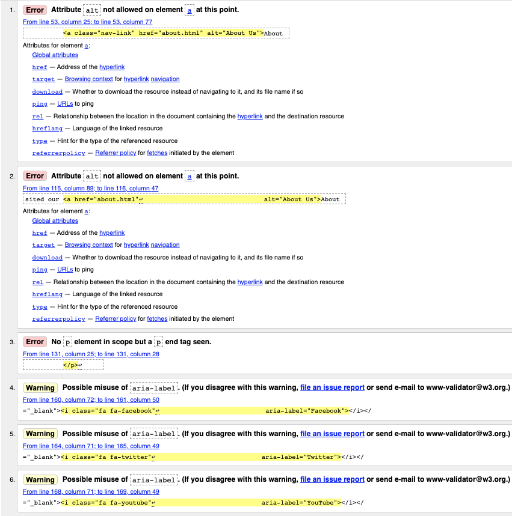

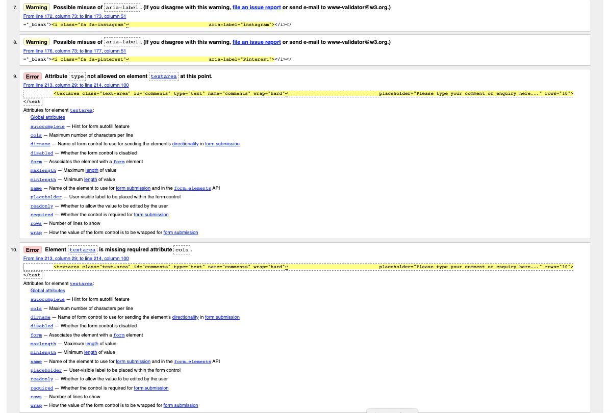

Issues identified and resolution:

-   Error: Attribute alt not allowed on element a at this point - removed alt attributes from anchor elements.
-   Error: no p element in scope but a p end tag seen - removed erroneous paragraph closing tag.
-   Warning: Possible misuse of aria-label - removed aria labels from icons and added to anchor elements.
-   Error: Attribute type not allowed on element textarea at this point - removed type attribute from textarea element.
-   Error: Element textarea is missing required attribute - added missing cols attribute to textarea element.

**Shop Dog page:**

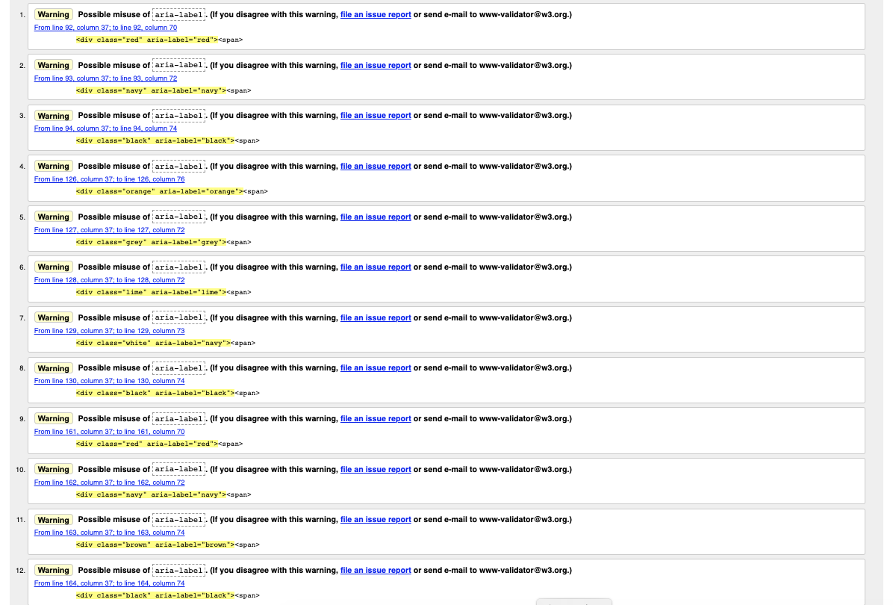

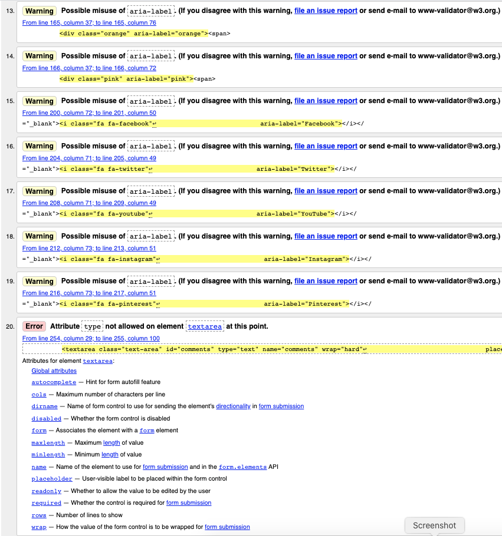

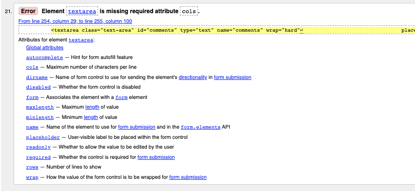

Issues identified and resolution:

-   Warning: Possible misuse of aria-label - removed aria labels from colour swatches.
-   Warning: Possible misuse of aria-label - removed aria labels from icons and added to anchor elements.
-   Error: Attribute type not allowed on element textarea at this point - removed type attribute from textarea element.
-   Error: Element textarea is missing required attribute - added missing cols attribute to textarea element.

**Shop Cat page:**

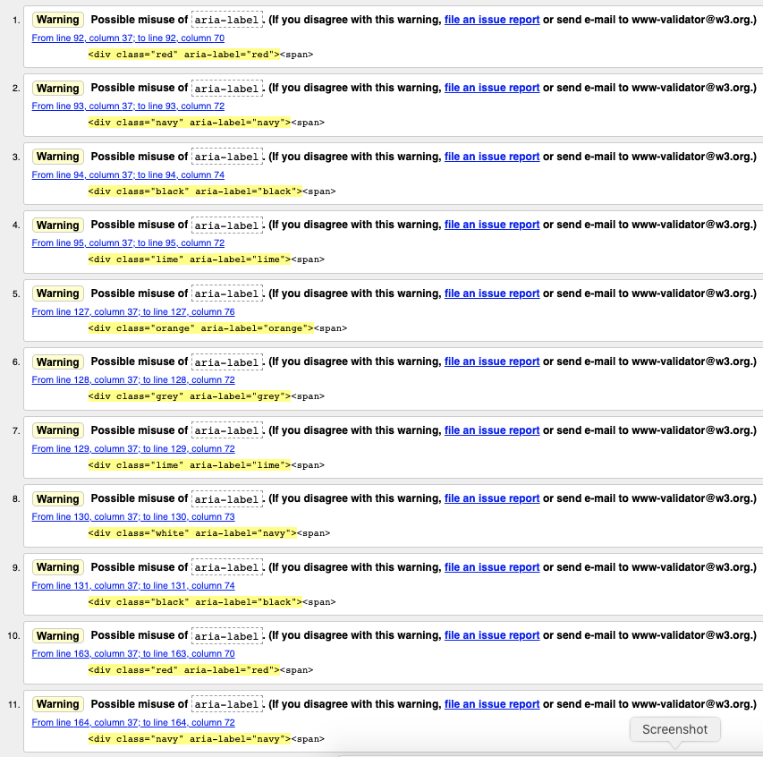

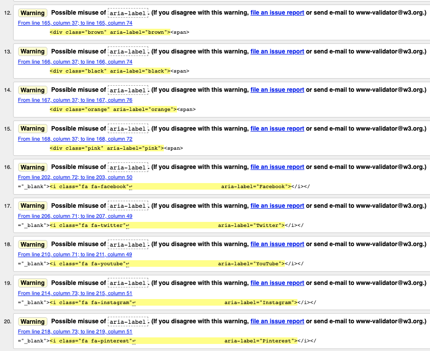

Issues identified and resolution:

-   Warning: Possible misuse of aria-label - removed aria labels from colour swatches.
-   Warning: Possible misuse of aria-label - removed aria labels from icons and added to anchor elements.
-   Error: Attribute type not allowed on element textarea at this point - removed type attribute from textarea element.
-   Error: Element textarea is missing required attribute - added missing cols attribute to textarea element.

**About Us page:**

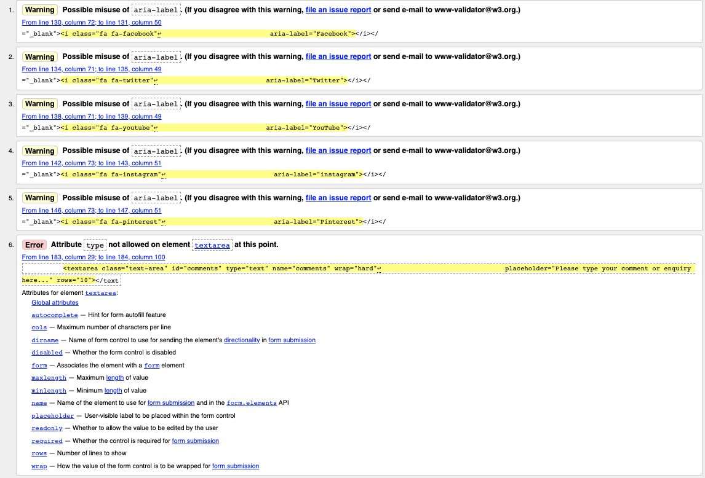

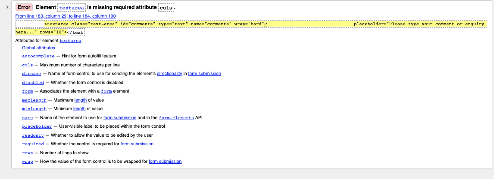

Issues identified and resolution:

-   Warning: Possible misuse of aria-label - removed aria labels from icons and added to anchor elements.
-   Error: Attribute type not allowed on element textarea at this point - removed type attribute from textarea element.
-   Error: Element textarea is missing required attribute - added missing cols attribute to textarea element.

**CSS**

The CSS code was validated using the [W3.org CSS validation service](https://jigsaw.w3.org/css-validator/).

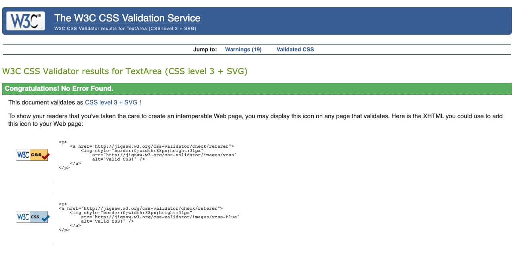

#### Functional, Usability, Compatibility and Responsiveness Testing

The functional, usability and compatibility test results and JIRA defect references for test cycle 1 are detailed in the [test tracker](testing-files/urban-paws-website-test-tracker-cycle-1.pdf).

The following defects were raised in JIRA:

-   JIRA reference UP-43: Text colour on navigation menu does not comply with Urban Paws brand guidelines - *Fixed by changing font colour.*
-   JIRA reference UP-44: The website takes more than 1 second to load on mobile devices - *Although attempts were made to improve the load time for mobile devices is was not possible to achieve a score of > 95 without further technical enhancements. The performance is considered acceptable by the Urban Paws business owner.*
-   JIRA reference UP-45: The Lighthouse SEO score is sub-optimal, and less than 95 - *Fixed by adding meta-descriptions to all pages.*
-   JIRA reference UP-46: The Lighthouse Best Practices score is sub-optimal, and less than 95 - *Added rel="noopener and norefferer" tags to links. Updated JavaScript libraries to include libraries with no vulnerabilities. Updated images to include correct aspect ratios.*
-   JIRA reference UP-47: The close button appears outside the Contact Us form modal - *Code updated to correctly position button.*
-   JIRA reference UP-48: The Lighthouse Accessibility score is sub-optimal, and less than 95 - *Contrast ratios were improved by utilising different font and background colours for the affected areas of the website navigation and buttons.*
-   JIRA reference UP-49: The HTML code is failing validation checks - *All issues addressed and results for test cycle 2 show no validation errors.*

**Responsiveness test results:**

The website was tested for responsiveness using [Google Chrome DevTools](https://developers.google.com/web/tools/chrome-devtools) and [Responsive Design Checker](https://www.responsivedesignchecker.com/).

Results:

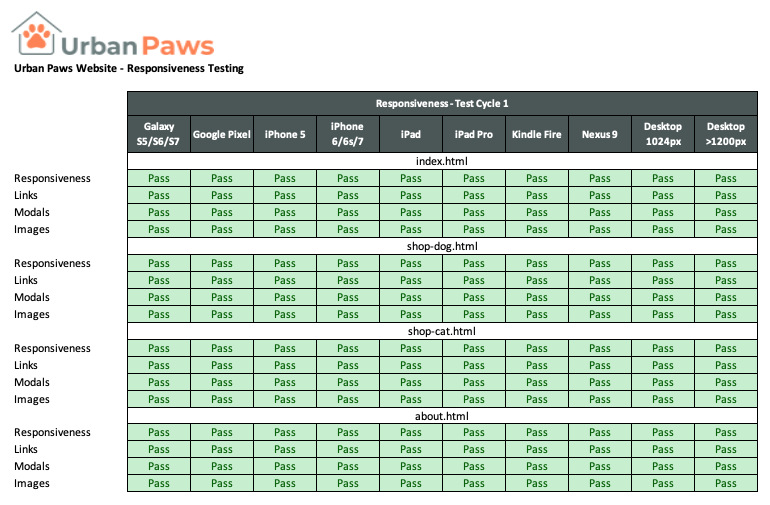

#### Performance, Accessibility, Best Practice and SEO Testing

Due to the technical nature of some opportunities identified in the Lighthouse reports being beyond the scope of this project only those listed below have been resolved.

**Desktop:**

Lighthouse report for the [Home page](https://matty-el.github.io/urban-paws/testing-files/desktop-index-test-cycle-1.html).

Issues identified for resolution:

Performance (98)

-   Opportunity: Properly size images - images resized.
-   Opportunity: Eliminate render-blocking resources - deferred the loading of Bootstrap scripts.

Accessibility (98)

-   Contrast: Background and foreground colours do not have sufficient contrast ratio - Home, Shop, About Us and Contact menu items - changed text colour to #566465 to achieve greater contrast and the current page link changed to 500 weight font.

Best Practices (79)

-   Trust and Safety: Links to cross-origin destinations are unsafe - added rel="noopener and norefferer" tags to links.
-   Trust and Safety: Includes front-end JavaScript libraries with known security vulnerabilities - updated to libraries with no vulnerabilities.
-   User Experience: Displays images with incorrect aspect ratio (Shop Cat image) - changed aspect ratio.

SEO (90)

-   Content Best Practices: Document does not have a meta-description - a meta-description is included and is now recognised.
 

Lighthouse report for the [Shop Dog page](https://matty-el.github.io/urban-paws/testing-files/desktop-shop-dog-test-cycle-1.html).

Issues identified for resolution:

Performance (99)

-   Opportunity: Properly size images - images resized.
-   Opportunity: Eliminate render-blocking resources - deferred the loading of Bootstrap scripts.

Accessibility (98)

-   Contrast: Background and foreground colours do not have sufficient contrast ratio - Home, Shop, About Us and Contact menu items - changed text colour to #566465 to achieve greater contrast and the current page link changed to 500 weight font.

Best Practices (79)

-   Trust and Safety: Links to cross-origin destinations are unsafe - added rel="noopener and norefferer" tags to links.
-   Trust and Safety: Includes front-end JavaScript libraries with known security vulnerabilities - updated to libraries with no vulnerabilities.
-   User Experience: Displays images with incorrect aspect ratio (Shop Cat image) - changed aspect ratio.

SEO (80)

-   Content Best Practices: Document does not have a meta-description - a meta-description is included and now recognised.
 

Lighthouse report for the [Shop Cat page](https://matty-el.github.io/urban-paws/testing-files/desktop-shop-cat-test-cycle-1.html).

Issues identified for resolution:

Performance (97)

-   Opportunity: Properly size images - images resized.
-   Opportunity: Eliminate render-blocking resources - deferred the loading of Bootstrap scripts.

Accessibility (98)

-   Contrast: Background and foreground colours do not have sufficient contrast ratio - Shop, About Us and Contact menu items - changed text colour to #566465 to achieve greater contrast and the current page link changed to 500 weight font.

Best Practices (79)

-   Trust and Safety: Links to cross-origin destinations are unsafe - added rel="noopener and norefferer" tags to links.
-   Trust and Safety: Includes front-end JavaScript libraries with known security vulnerabilities - updated to libraries with no vulnerabilities.
-   User Experience: Displays images with incorrect aspect ratio (Shop Cat image) - changed aspect ratio.

SEO (80)

-   Content Best Practices: Document does not have a meta-description - a meta-description is included and is now recognised.
 

Lighthouse report for the [About Us page](https://matty-el.github.io/urban-paws/testing-files/desktop-about-test-cycle-1.html).

Issues identified for resolution:

Performance (98)

-   Opportunity: Properly size images - images resized.
-   Opportunity: Eliminate render-blocking resources - deferred the loading of Bootstrap scripts.

Accessibility (97)

-   Contrast: Background and foreground colours do not have sufficient contrast ratio - Shop, About Us and Contact menu items - changed text colour to #566465 to achieve greater contrast and the current page link changed to 500 weight font.
-   Navigation: Heading elements are not in sequentially descending order - changed sequential order of headings.

Best Practices (79)

-   Trust and Safety: Links to cross-origin destinations are unsafe - added rel="noopener and norefferer" tags to links.
-   Trust and Safety: Includes front-end JavaScript libraries with known security vulnerabilities - updated to libraries with no vulnerabilities.
-   User Experience: Displays images with incorrect aspect ratio (Shop Cat image) - changed aspect ratio.

SEO (80)

-   Content Best Practices: Document does not have a meta-description - a meta-description is included and the issue is resolved.

**Mobile:**

Lighthouse report for the [Home page](https://matty-el.github.io/urban-paws/testing-files/mobile-index-test-cycle-1.html).

Issues identified for resolution:

Performance (70)

-   Opportunity: Eliminate render-blocking resources - deferred the loading of Bootstrap scripts.

Accessibility (100)

-   No issues identified.

Best Practices (71)

-   Trust and Safety: Links to cross-origin destinations are unsafe - added rel="noopener and norefferer" tags to links.
-   Trust and Safety: Includes front-end JavaScript libraries with known security vulnerabilities - updated to libraries with no vulnerabilities.
-   User Experience: Displays images with incorrect aspect ratio (Shop Cat image) - changed aspect ratio.

SEO (100)

-   No issues identified.
 

Lighthouse report for the [Shop Dog page](https://matty-el.github.io/urban-paws/testing-files/mobile-shop-dog-test-cycle-1.html).

Issues identified for resolution:

Performance (79)

-   Opportunity: Eliminate render-blocking resources - deferred the loading of Bootstrap scripts.

Accessibility (97)

-   Contrast: Background and foreground colours do not have sufficient contrast ratio - Shop, About Us and Contact menu items - changed text colour to #566465 to achieve greater contrast and the current page link changed to 500 weight font.

Best Practices (71)

-   Trust and Safety: Links to cross-origin destinations are unsafe - added rel="noopener and norefferer" tags to links.
-   Trust and Safety: Includes front-end JavaScript libraries with known security vulnerabilities - updated to libraries with no vulnerabilities.
-   User Experience: Displays images with incorrect aspect ratio - changed aspect ratio.

SEO (92)

-   No significant issues.
 

Lighthouse report for the [Shop Cat page](https://matty-el.github.io/urban-paws/testing-files/mobile-shop-cat-test-cycle-1.html).

Issues identified for resolution:

Performance (77)

-   Opportunity: Eliminate render-blocking resources - deferred the loading of Bootstrap scripts.

Accessibility (97)

-   Contrast: Background and foreground colours do not have sufficient contrast ratio - Shop, About Us and Contact menu items - changed text colour to #566465 to achieve greater contrast and the current page link changed to 500 weight font.

Best Practices (71)

-   Trust and Safety: Links to cross-origin destinations are unsafe - added rel="noopener and norefferer" tags to links.
-   Trust and Safety: Includes front-end JavaScript libraries with known security vulnerabilities - updated to libraries with no vulnerabilities.
-   User Experience: Displays images with incorrect aspect ratio (Shop Cat image) - changed aspect ratio.

SEO (92)

-   No significant issues.
 

Lighthouse report for the [About Us page](https://matty-el.github.io/urban-paws/testing-files/mobile-about-test-cycle-1.html).

Issues identified for resolution:

Performance (70)

-   Opportunity: Eliminate render-blocking resources - deferred the loading of Bootstrap scripts.

Accessibility (98)

-    Navigation: Heading elements are not in sequentially descending order - changed sequential order of headings.

Best Practices (71)

-   Trust and Safety: Links to cross-origin destinations are unsafe - added rel="noopener and norefferer" tags to links.
-   Trust and Safety: Includes front-end JavaScript libraries with known security vulnerabilities - updated to libraries with no vulnerabilities.
-   User Experience: Displays images with incorrect aspect ratio (Shop Cat image) - changed aspect ratio.

SEO (92)

-   No significant issues.

### Test Cycle 2

#### Code validation

**HTML**

The HTML code was validated using the [W3.org markup validation service](https://validator.w3.org/).

All issues identified during the first test cycle were resolved.

**Home page:**

Home page HTML validator [results](https://validator.w3.org/nu/?showsource=yes&showoutline=yes&showimagereport=yes&doc=https%3A%2F%2Fmatty-el.github.io%2Furban-paws%2Findex.html).

Issues identified and resolution:

-   No issues were identified.

**Shop Dog page:**

Shop Dog page HTML validator [results](https://validator.w3.org/nu/?showsource=yes&showoutline=yes&showimagereport=yes&doc=https%3A%2F%2Fmatty-el.github.io%2Furban-paws%2Fshop-dog.html).

Issues identified and resolution:

-   No issues were identified.

**Shop Cat page:**

Shop Cat page HTML validator [results](https://validator.w3.org/nu/?showsource=yes&showoutline=yes&showimagereport=yes&doc=https%3A%2F%2Fmatty-el.github.io%2Furban-paws%2Fshop-cat.html).

Issues identified and resolution:

-   No issues were identified.

**About Us page:**

About Us page HTML validator [results](https://validator.w3.org/nu/?showsource=yes&showoutline=yes&showimagereport=yes&doc=https%3A%2F%2Fmatty-el.github.io%2Furban-paws%2Fabout.html).

Issues identified and resolution:

-   No issues were identified.

**CSS**

The CSS code was validated using the [W3.org CSS validation service](https://jigsaw.w3.org/css-validator/).

CSS validator results:

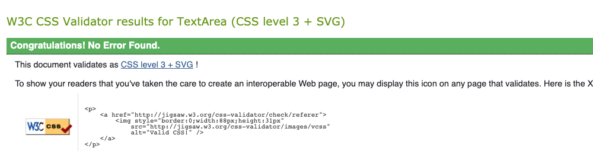.

Issues identified and resolution:

-   No issues were identified.

#### Functional, Usability, Compatibility and Responsiveness Testing

The functional, usability and compatibility test results and defect references are detailed in the [test tracker](testing-files/urban-paws-website-test-tracker-final.pdf).

**Responsiveness test results:**

The website was tested for responsiveness using [Google Chrome DevTools](https://developers.google.com/web/tools/chrome-devtools) and [Responsive Design Checker](https://www.responsivedesignchecker.com/)

Results:

#### Performance, Accessibility, Best Practice and SEO Testing

**Desktop:**

All tests passed with only the performance tests for the Home page (score 99) and About Us page (score 99) not achieving the maximum score of 100.

-   Lighthouse report for the [Home page](https://matty-el.github.io/urban-paws/testing-files/desktop-index-test-cycle-2.html)
-   Lighthouse report for the [Shop Dog page](https://matty-el.github.io/urban-paws/testing-files/desktop-shop-dog-test-cycle-2.html)
-   Lighthouse report for the [Shop Cat page](https://matty-el.github.io/urban-paws/testing-files/desktop-shop-cat-test-cycle-2.html)
-   Lighthouse report for the [About Us page](https://matty-el.github.io/urban-paws/testing-files/desktop-about-test-cycle-2.html)

Issues identified and resolution:

-   No significant issues were identified.

**Mobile:**

Although the performance scores could be improved by further technical enhancements no significant issues were identified.

-   Lighthouse report for the [Home page](https://matty-el.github.io/urban-paws/testing-files/mobile-index-test-cycle-2.html)
-   Lighthouse report for the [Shop Dog page](https://matty-el.github.io/urban-paws/testing-files/mobile-shop-dog-test-cycle-2.html)
-   Lighthouse report for the [Shop Cat page](https://matty-el.github.io/urban-paws/testing-files/mobile-shop-cat-test-cycle-2.html)
-   Lighthouse report for the [About Us page](https://matty-el.github.io/urban-paws/testing-files/mobile-about-test-cycle-2.html)

Issues identified and resolution:

-   No significant issues were identified.

## Approvals

Following testing the website received sign-off from the owner of Urban Paws.

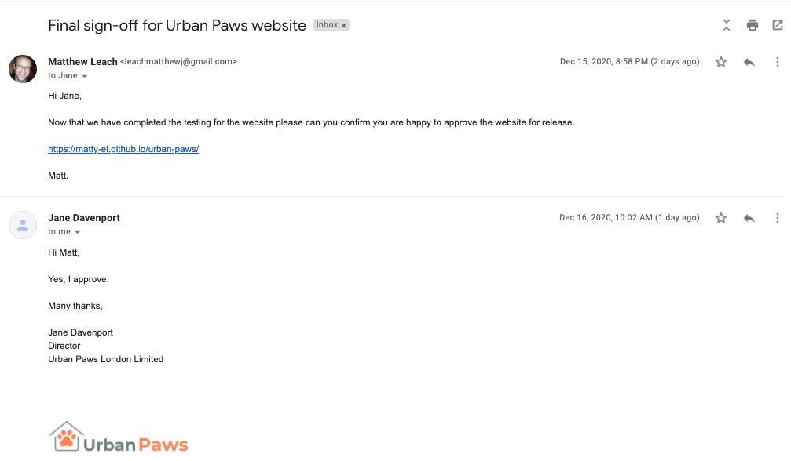

[Go back to README.md file](README.md).
